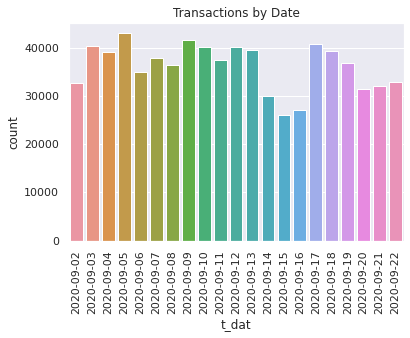
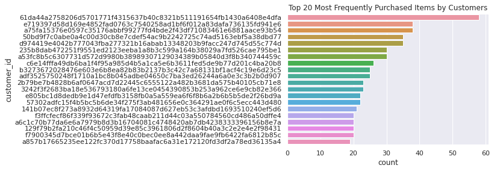

### Authors: Samantha Bellofatto and Sarthak Mital
#### Prof. Monogioudis
#### CS 301-104: Introduction to Data Science
#### April 24, 2022

<h1 align="center">H&M Fashion Recommendation System</h1>

## Abstract
Our project focuses on predicting which items a customer will buy in the future from a store. Specifically, the data we used is for customers 
shopping at H&M. We created a model that recommends 12 unique articles to each customer in the training data using a variety of methods. Our 
model involved the relationship between a customers’ past purchases, most frequently purchased items, and most popular items in general. By 
combining these three ideas, we were able to come up with 12 articles for each customer that they are likely to be interested in purchasing. 
Our results show that the unique number of predicted articles is much less than the number of unique articles offered for sale. Our results 
also show that predicting purchases for customers with little to no purchase history is based on general popularity, and can therefore be 
generalized for first-time customers.

## Introduction
The problem we are working on is figuring out what items a customer is likely to buy next based on past transactions. This problem is important
for any retail business because they need to have a general understanding of what their customers are looking to buy. Since retail stores need 
to choose which products should be out on the sales floor, they can make the most of their space by picking items that are more likely to be 
purchased rather than items that would not be bought. Especially as online shopping becomes more prevalent, it is important for physical retail 
stores to try to maximize their sales in any way that they can. By creating a model that predicts which items each customer is most likely to 
purchase in the future, a potential retailer could use these predictions to influence which items would be put out on their sales floor. From 
our model, we were able to see that we recommended 25,912 unique articles which is much less than the total number of articles the store sells 
(105,542 articles). This shows how the store could potentially optimize their sales by focusing on these recommended articles to stock their 
stores since more customers would be buying these items than the articles not included in the recommendations.

## Related Work
In [this paper](https://www.researchgate.net/publication/221140924_Utilizing_related_products_for_post-purchase_recommendation_in_e-commerce), they discuss how “related categories and products” is a hybrid approach of content based and collaborative filtering. After attempting to try other resource heavy approaches, we settled on this one considering that we never even tried accounting for photos in the data. Our models were purely based on the 3 csv files, and we still couldn’t get it to run on colab on the whole set. This model essentially uses content based filtering as an aid to collaborative filtering to increase the scope of our recommendations. We use both customer’s behavioral and product data to recommend items to purchase in a week’s time. This is very similar to what we were trying to achieve with our NN model, combining all article and customer data into a matrix and classifying it using layers.

The other [TowardsDataScience article](https://towardsdatascience.com/the-frequently-bought-together-recommendation-system-b4ed076b24e5) adds frequently bought together items into the mix, which further increases the scope of these recommendations. It is a simple yet effective method of developing an association rules table between items that might be bought together.

We use ideas from both these approaches to form our model.

## Data
The data we are working with is from the [H&M Personalized Fashion Recommendations Kaggle competition](https://www.kaggle.com/competitions/h-and-m-personalized-fashion-recommendations) 
which was collected by H&M Group. They provided 3 data files: articles.csv, customers.csv, and transactions_train.csv. Along with these files, 
the competition also provided images for each article in articles.csv as well as a sample submission file called sample_submission.csv. For our 
project, we only used the **transactions_train.csv** data file mentioned above, as well as the **sample_submission.csv** to format our results.

The **transactions_train.csv** file is a comma-separated value file of data related to each transaction between 09/18/2018 and 09/22/2020. Every 
article that was purchased has its own entry in the file, even if they were part of the same purchase from the same customer. This means that the 
total number of transactions is equal to the total number of articles sold. It contains the following 5 variables for each transaction: t_dat, 
customer_id, article_id, price, and sales_channel_id. In our project, we focused on the variables ‘t_dat’, ‘customer_id’, and ‘article_id’ in order 
to find relationships between the date of purchase, customer, and article purchased. The original file contains 31.8 million entries, so we used a 
subset of this data using transactions after 09/01/2020 in order to make computations possible using Google Colab. The subset of data that we used 
for our calculations contains 760,209 transaction entries. We chose to use the most recent month of training data because the task is to predict 
the articles purchased by each customer in the 7 day period following the training data time period. By using the most recent entries, we will be 
able to more accurately predict these articles rather than if we had chosen the earlier month of transactions data.

The **sample_submission.csv** is a comma-separated value file that contains each unique customer_id as well as a variable called ‘predictions’. The 
‘predictions’ variable contains 12 unique article_id’s that correspond to the articles that you are predicting will be purchased. This file serves 
as a guideline for the submission process of the Kaggle notebook. In our Colab code, we used the file as a way of formatting our results to show the 
12 predicted articles for each customer. This format allows us to submit our entry to the Kaggle competition to be judged.

## Methods
Recommender systems come in 2 flavors - content based filtering system and collaborative filtering system. Content based systems make use of the 
similarity of the object data(articles and their details like color, name, size, etc in our case) to predict what similar item the user might be 
interested in, while collaborative systems(as the name suggests) make predictions combining the interest shown on the different items by other people. 
The assumption behind the collaborative filtering method is that if  person A has the same opinion as another person B on an issue, A is more likely 
to share B’s opinion on a different issue than that of a randomly chosen person.

Looking at the data, it looks like a textbook multidimensional classification problem with no hint or bounds on the number of clusters there can be, 
which comes under the umbrella of collaborative filtering.

We first combined all the columns among the 3 csv files to come up with a dataframe that had its rows indexed with Customer IDs, and the columns with 
all useful data on each purchase. The last column was a 0, 1 or 2, indicating if/how the item was purchased.

In the end, our goal was to fill a separate Customer_ID x Article_ID dataframe with those numbers, which we would iterate through in the end to 
generate a list of all the items each user might be interested in.

We approached the problem as a model-based CF problem in a few methods with various levels of success which are described below:
<ol>
  <li><strong>K-mean clustering</strong> - Our goal here was to cluster different articles in the multidimensional matrix we had, giving us the flexibility of working with many variables to fit our data. With our approach, this came at the cost of performance, we could not get it to run on colab without running out of ram.</li>
  <li><strong>Neural Network (NN)</strong> - Since there was no 2D information to be inferred from, we settled on regular NN instead of Convolutional Neural Networks. This approach was our preferred one, since we could visualize what pattern each layer could pick up and how the model would run in different phases. We approached it with a subset of data, which included reducing the number of columns, but it would only work on 10% of customer data and about 5 columns before it would start crashing. We scrapped it after a few runs since we couldn’t tune it without it working.</li>
</ol>

The last and the final approach we could get working on Colab (without running out of RAM limit) was simple item based collaborative filtering.

## Experiments
For our model, we used the previous transaction data to predict what articles each customer would be likely to buy in the 7 days after the training data period ended. We used a combination of methods in order to have more personalized recommendations for each individual customer. The most broad recommendation method was using the most popular items from the month of September 2020, since the training data goes up until 09/22/2020. We used these most popular items as the last recommendation after the more personalized ones since their popularity would mean that many customers would be interested in purchasing them. The graph below shows the number of transactions per day for the available data in the month of September. This shows that there is not a large fluctuation in the number of purchases over the month, so it is reasonable to assume that the popular items during this time may stay popular for the next week.

One of the more personalized methods of recommending articles was by looking at each customers’ most frequently purchased items in the most recent week of the training data. This allowed us to recommend to customers their most often repurchased items since they would be likely to buy them again if they have a history of purchasing the article many times. The graph below shows the top 20 most frequently purchased articles by customers. This shows that customers repurchase items many times, meaning that it is reasonable to assume that they would be purchasing this article again in the next 7 days.

The other method we used was recommending items that were purchased together by the same customer. This allowed us to recommend articles to customers that share similar tastes since they have purchased the same item. Between the three of these methods, we were able to provide 12 article recommendations for each customer in the training data that they would be most likely to purchase.

Our model has a Mean Average Precision @12 (MAP@12) of 0.0141. MAP is a metric for evaluating models like ours that are attempting to detect specific items or objects. Our MAP@12 is relatively low since it is around 1.41% precision. However, looking at the Kaggle competition entries, the highest MAP@12 score is 0.0364. Since the datasets are so large and there are over 1.3 million customers to make recommendations for, the precision is generally low for most models.

## Conclusion
This project has allowed us to learn a lot about the different types of recommendation systems and the methods used for creating them. If we were to extend our model further, we could use other resources that would allow us to perform more complicated operations since we experienced some issues with the limitations of Colab. Moreover, we believe optimizing our neural network approach would have given us better results, so that is something that can be worked on. We think that our model could be used in a variety of different applications, not just retail or shopping data. By using an item based collaborative filtering approach, we could easily convert this model to fit different contexts as necessary.

